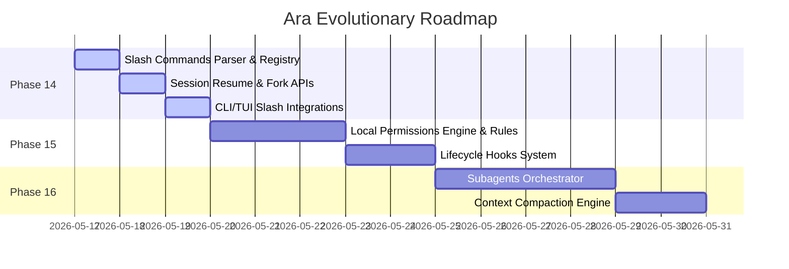

# 🗺️ Ara: Claude-Inspired Roadmap

This document outlines the architectural blueprint and future milestone releases for integrating observable, production-grade local agent features into the Ara control plane.

---

## 📅 Roadmap Overview



---

## 🚀 Future Milestones Design

### Milestone 1: Slash Commands & Transcripts (Phase 14 - Active)
* **Goal**: Provide standard developer prompts and manual session restoration utilities.
* **Scope**:
  - Implement `/help`, `/context`, `/compact`, `/model`, `/doctor`, `/memory`, `/skills`, `/permissions`.
  - Add JSONL session logging, resume, and fork endpoints.
  - Expose CLI operations: `ara resume`, `ara fork`, `ara context`, `ara compact`, `ara doctor`.

---

### Milestone 2: Hardened Permissions & Hooks (Phase 15 - Planned)
* **Goal**: Build a rule-based execution policy and lifecycle hooks to automate validation.
* **Architecture Draft**:
  ```typescript
  // packages/permissions/src/policy.ts
  export interface PermissionRule {
    toolName: string;
    pathPattern?: string;
    allow: boolean;
  }
  
  export class LocalPermissionsEngine {
    private rules: PermissionRule[] = [];
    
    constructor(rulesFile: string) {
      this.loadRules(rulesFile);
    }
    
    checkPermission(toolName: string, args: any): boolean {
      // Matches path patterns and checks rules list
      return true;
    }
  }
  ```
* **Hooks Lifecycle**:
  - `pre-agent`: Validates workspace conditions (e.g. running `npm run build` or checking branch clean status) before the agent starts.
  - `post-agent`: Runs lint check routines on modified source files.

---

### Milestone 3: Subagents & Automatic Context Compaction (Phase 16 - Planned)
* **Goal**: Enable scaling to huge codebases and long-running interactive development loops.
* **Architecture Draft**:
  - **Subagent Manager**: When the agent schedules a complex research task, it delegates to a subagent that runs in an isolated workspace worker thread.
  - **Auto Context Compactor**: A background parser that tracks token count and compresses history items when exceeding threshold targets.
    ```typescript
    export class ContextCompactor {
      static compactMessages(messages: ChatMessage[], keepLastN = 5): ChatMessage[] {
        // Keeps the last 5 messages intact
        // Summarizes older messages into a single system recap block
        return messages;
      }
    }
    ```
