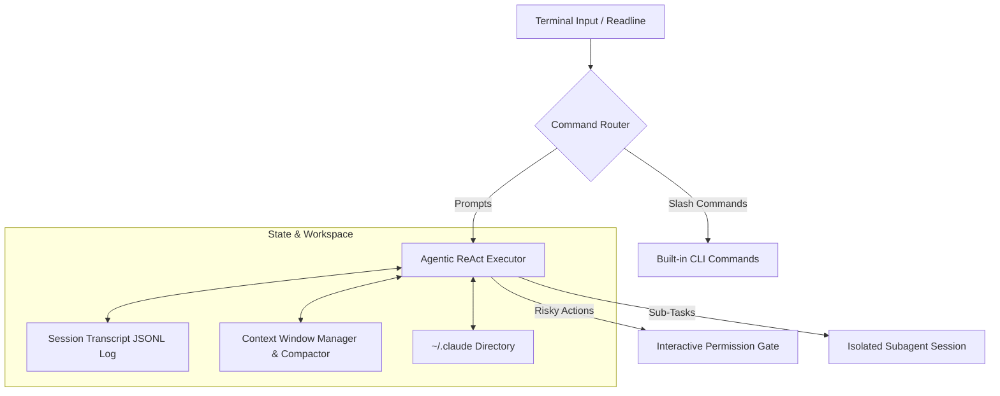

# 🧠 Observable Claude Code Architectural Patterns Study

This document analyzes the observable systems patterns, state lifecycles, and user experience components of Anthropic's Claude Code, compiled from public documentations and product behavior.

---

## 1. Core Architecture Patterns

### Key Design Principles

1. **Terminal-First & Local-First**: The agent is designed to run in a developer's local terminal, operating as a fast, context-aware utility without heavy web UI dependencies.
2. **Context Compactness**: Active management of the LLM context window using proactive token reduction, message summary, and history pruning to maintain agent velocity.
3. **Auditability & Traceability**: Session execution states, tool inputs/outputs, and prompt transcripts are logged locally in a structured JSONL format to support replay, resume, and fork behaviors.

---

## 2. Analyzed Claude Code Concepts

### A. Agentic Loop (ReAct Lifecycle)
The loop follows a rigid, synchronous iteration:
1. **Understand**: User prompt or tool output is digested.
2. **Plan**: Prompt context + System prompts generate a thought block.
3. **Execute**: Select tool, execute locally, and capture console stdout/stderr.
4. **Reflect**: Check results, update memory, and plan next actions.

### B. Session Transcripts, Resume, and Fork
* **Transcript Logging**: Conversations and tool states are written to disk in real-time as JSONL packets, enabling developers to review past actions or tools called.
* **Resume**: Re-loads a prior session by re-playing the JSONL history back into the agent context, picking up from the last message.
* **Fork**: Spawns a new session from a specific message index of an existing transcript, allowing developers to test alternative command execution pathways without polluting the primary history.

### C. CLAUDE.md & Auto Memory
* **CLAUDE.md**: A file-based guide in the CWD providing instructions, constraints, and commands to the agent.
* **Auto Memory**: Automatically appends crucial project insights, build configurations, and path information back to `CLAUDE.md` or a local memory index upon command completion.

### D. `.claude` Directory Structure
Stores execution metadata inside the project workspace:
* `/sessions/`: JSONL session files.
* `/config.json`: Local settings and API endpoint parameters.
* `/backups/`: Auto-backups taken before editing source files.

### E. Permission Modes & Allow/Deny Rules
Observable modes control action execution:
* **Allowlist**: Specific safe tools run automatically.
* **Approval Gates**: Risky tools trigger prompt confirmations.
* **Non-Interactive**: Returns non-zero codes if a permission check fails.

### F. Hooks Lifecycle
Triggers scripts at hook points:
* `pre-agent`: Fires before the loop starts.
* `post-agent`: Fires after session completions.
* `pre-tool`: Intercepts tool parameters.

### G. Checkpointing & Rewind
* **Checkpoint**: Captures Git commits or local folder diffs before editing files.
* **Rewind**: Restores files to a prior checkpoint if a shell execution fails.

### H. Context Management & Compaction
* **Compaction**: When the context window reaches capacity, the oldest chat histories are summarized into single paragraphs while keeping the active tool state and local files context clear.

### I. Subagents
* **Subagent Executor**: Spawns independent sub-sessions to solve isolated tasks (e.g. searching directories) without polluting the parent agent's workspace token context.
* **Return Value**: The child yields a clean markdown summary back to the parent.
