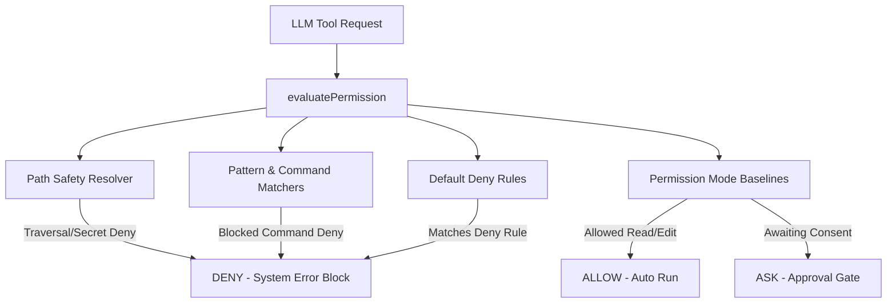

# 🛡️ Ara Personal Permission Engine

The Ara Personal Permission Engine is a core security guard module that sits before the Approval Gate and validates all tool requests against robust, multi-layer authorization rules.

It enforces a modern security posture across five modes, protecting the local workspace from directory traversals, credentials leaks, privilege escalations, network exfiltrations, and destructive commands.

---

## 🏗️ Architecture & Component Layers



### 1. Path Safety & Normalization Resolver (`resolvePathSafety.ts`)
- Normalizes all paths to forward slashes (`/`) and lowercases Windows drive letters to avoid platform checks bypass.
- Prevents directory traversal attacks (`../`) by ensuring the normalized path remains strictly within the workspace CWD boundary.
- Explicitly blocks access to null bytes (`\0`) and home secrets (`~/.ssh`, `~/.aws`, `~/.config/gcloud`).
- Follows and audit-resolves symlinks using `fs.realpathSync`, verifying that their absolute resolved target does not point outside the workspace.

### 2. Pattern Matchers (`matchPathRule.ts` & `matchCommandRule.ts`)
- **Path Globs**: Converts wildcard path patterns (e.g. `**/*.pem`, `.env*`) to optimized JavaScript RegExps.
- **Command Wildcards**: Evaluates command lines against shell patterns, literal substrings, or complex RegExps to detect dangerous syntax.

### 3. Default Deny Baseline Rules (`defaultRules.ts`)
- **Secrets Block**: Strictly blocks access to `.env`, `.env.*`, `~/.ssh/**`, `~/.aws/**`, SSL/SSH keys (`.pem`, `.key`, `id_rsa`), and credentials.
- **Privilege Escalation**: Blocks privilege escalations (such as `sudo`).
- **Destructive Shells**: Blocks destructive operations like `rm -rf`, `DROP TABLE`, and bulk database wipes.
- **Secret Prints**: Blocks environment printing commands (`printenv`, `env`) to prevent key exposure.
- **Network Exfiltration**: Blocks background downloads and exfiltration tools (`curl -F`, `/dev/tcp`).

---

## ⚙️ Security & Authorization Modes

The Permission Engine orchestrates the system's security posture across five distinct Modes:

| Permission Mode | Safe Reads | File Writes / Edits | Shell Executions | Destructive Commands |
| :--- | :--- | :--- | :--- | :--- |
| **`plan`** | 🟢 `allow` | 🔴 `deny` | 🔴 `deny` | 🔴 `deny` |
| **`default`** | 🟢 `allow` | 🟡 `ask` | 🟡 `ask` | 🔴 `deny` |
| **`accept-edits`** | 🟢 `allow` | 🟢 `allow` | 🟡 `ask` | 🔴 `deny` |
| **`auto-safe`** | 🟢 `allow` | 🟡 `ask` | 🟢 `allow` (Safe ONLY) / 🟡 `ask` | 🔴 `deny` |
| **`danger-review`** | 🟡 `ask` | 🟡 `ask` | 🟡 `ask` | 🔴 `deny` |

---

## 🌐 API Integrations (`GET /api/permissions`)

The API exposes four endpoints mapping permission actions:

- `GET /api/permissions`: Lists current active permission mode, default deny lists, and loaded tools settings.
- `GET /api/permissions/mode`: Returns active permission mode configuration.
- `PATCH /api/permissions/mode`: Dynamically updates the global permission mode profile.
- `POST /api/permissions/evaluate`: Direct evaluator testing endpoint.

---

## 💻 CLI Commands (`ara permissions`)

Enables CLI operators to query and transition safety states from their shell:

### 1. View Permission Status
```bash
ara permissions
```
Outputs:
```text
🛡️ Ara Personal Permission Engine Status:
-------------------------------------------------------------
Active Security Mode:  DEFAULT
Blocked Secrets:       .env, ~/.ssh/**, ~/.aws/**, ~/.config/gcloud/**, private keys
Blocked Commands:      rm -rf, sudo, curl | sh, wget | sh, DROP TABLE, env leaks

Registered Tools:
  🔧 list_files       - Danger Level: safe
  🔧 read_file        - Danger Level: safe
  ...
-------------------------------------------------------------
```

### 2. Transition Global Modes
```bash
ara permissions <plan | default | accept-edits | auto-safe | danger-review>
```
Updates global security thresholds dynamically with instant system-wide coverage.

---

## 💬 Slash Commands

Interact and update security directly inside the conversational chat loop:

- `/permissions`: View active security mode, rules, and registers.
- `/permissions mode <mode>`: Dynamically update active security mode profile.

---

## 🖥️ Ink TUI Visual Indicators

The Ink Terminal User Interface (`TuiApp.tsx`) incorporates permissions beautifully:

1. **Dashboard Status Bar**: Clearly displays `Shield Mode: <MODE>` in a bold, yellow status highlight alongside the active tab index.
2. **Inline Denied Warnings**: Blocked tool calls are printed inline inside the chat conversation feed in a prominent, bold, **red security warning banner** indicating the exact rule violation.
3. **Status Tab**: The global settings inspector displays full status configurations including active permission profile.

---

## 🧪 Comprehensive Tests Validation

Validated by **100% passing tests** containing strict assertions:
- Absolute and relative traversal boundary escapes are blocked.
- Windows admin symlink boundaries bypass check is blocked.
- Reading SSH/SSL credentials and `.env` secrets is blocked.
- Sudo privilege scaling and malicious piping are blocked.
- Plan, Default, Accept-Edits, and Danger-Review modes execute correctly.
- Agent Streaming Loop writes denied attempts to the Hono audit database log correctly.
